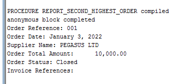

Sarvesh Soochit                                                                                                                                         30 APR 2024
# SQL Assignment
To create and normalize the database schema based on the information provided in the scenario, we need to follow best practices for naming conventions and ensure data normalization. The description indicates a need for extracting and organizing data related to Purchase Orders, Invoices, and Payments from a raw table named XXBCM\_ORDER\_MGT. Below is an example of how the schema could be designed and normalized.

Tools Used:

1. Oracle SQL Developer
1. Notepad++
## **Proposed Database Schema**
1. **XXBCM\_ORDER\_MGT**
- ORDER\_REF 			
- ORDER\_DATE 			
- SUPPLIER\_NAME 		
- SUPP\_CONTACT\_NAME 	
- SUPP\_ADDRESS 		
- SUPP\_CONTACT\_NUMBER 
- SUPP\_EMAIL 			
- ORDER\_TOTAL\_AMOUNT 	
- ORDER\_DESCRIPTION 	
- ORDER\_STATUS 		
- ORDER\_LINE\_AMOUNT 	
- INVOICE\_REFERENCE 	
- INVOICE\_DATE 		
- INVOICE\_STATUS 		
- INVOICE\_HOLD\_REASON 
- INVOICE\_AMOUNT 		
- INVOICE\_DESCRIPTION 
1. **XXBCM\_SUPPLIER\_TBL**
- SUPPLIER\_NAME 	
- FIRST\_NAME
- LAST\_NAME
- SUPP\_ADDRESS 	
- TEL\_NUMBER
- MOBILE\_NUMBER
- SUPP\_EMAIL\_ADD** 

**	

1. **XXBCM\_ORDER\_TBL**
- ORDER\_ID
- ORDER\_REF 		
- SUPPLIER\_NAME		
- ORDER\_DATE 		
- ORDER\_TOTAL\_AMOUNT
- ORDER\_DESCRIPTION
- ORDER\_STATUS	
- ORDER\_LINE\_AMOUNT
1. **XXBCM\_INVOICE\_TBL**
- INVOICE\_ID
- INVOICE\_REFERENCE 	
- ORDER\_REF		
- INVOICE\_DATE	
- INVOICE\_STATUS		
- INVOICE\_HOLD\_REASON
- INVOICE\_AMOUNT	
- INVOICE\_DESCRIPTION
## **Normalization**
- **1st Normal Form (1NF):** Each table has a primary key, and all attributes contain only atomic values.
- **2nd Normal Form (2NF):** All attributes in the table depend solely on the primary key.
- **3rd Normal Form (3NF):** All fields can only depend on the primary key and not on other fields.

# SQL to Create Tables
***-- TABLE NORMALISATION***

`  `**CREATE** **TABLE** XXBCM\_ORDER\_MGT 

`   `**(**    

`    `ORDER\_REF           **VARCHAR2(**2000**),** 

`    `ORDER\_DATE          **VARCHAR2(**2000**),** 

`    `SUPPLIER\_NAME       **VARCHAR2(**2000**),** 

`    `SUPP\_CONTACT\_NAME   **VARCHAR2(**2000**),** 

`    `SUPP\_ADDRESS        **VARCHAR2(**2000**),** 

`    `SUPP\_CONTACT\_NUMBER **VARCHAR2(**2000**),** 

`    `SUPP\_EMAIL          **VARCHAR2(**2000**),** 

`    `ORDER\_TOTAL\_AMOUNT  **VARCHAR2(**2000**),** 

`    `ORDER\_DESCRIPTION   **VARCHAR2(**2000**),** 

`    `ORDER\_STATUS        **VARCHAR2(**2000**),** 

`    `ORDER\_LINE\_AMOUNT   **VARCHAR2(**2000**),** 

`    `INVOICE\_REFERENCE   **VARCHAR2(**2000**),** 

`    `INVOICE\_DATE        **VARCHAR2(**2000**),** 

`    `INVOICE\_STATUS      **VARCHAR2(**2000**),** 

`    `INVOICE\_HOLD\_REASON **VARCHAR2(**2000**),** 

`    `INVOICE\_AMOUNT      **VARCHAR2(**2000**),** 

`    `INVOICE\_DESCRIPTION **VARCHAR2(**2000**)**

`   `**)** **;**

`    `**CREATE** **TABLE** XXBCM\_SUPPLIER\_TBL

`   `**(**

`    `SUPPLIER\_NAME       **VARCHAR2(**1000**)** **NOT** **NULL,** 

`    `FIRST\_NAME  **VARCHAR2(**500**)**  **NOT** **NULL,**

`    `LAST\_NAME   **VARCHAR2(**500**)**  **NOT** **NULL,**    

`    `SUPP\_ADDRESS        **VARCHAR2(**2000**),**

`    `TEL\_NUMBER **VARCHAR2(**8**),**

`    `MOBILE\_NUMBER **VARCHAR2(**8**),**  

`    `SUPP\_EMAIL\_ADD          **VARCHAR2(**200**),**

`    `**CONSTRAINT** XXBCM\_SUPPLIER\_PK **PRIMARY** **KEY** **(**SUPPLIER\_NAME**)**

`    `**)** **;**

**CREATE** **TABLE** XXBCM\_ORDER\_TBL

`   `**(**

`    `ORDER\_ID **INTEGER** GENERATED ALWAYS **AS** **IDENTITY** **(START** **WITH** 1 **INCREMENT** **BY** 1**)** **NOT** **NULL,**

`    `ORDER\_REF           **VARCHAR2(**15**)** **NOT** **NULL,** 

`    `SUPPLIER\_NAME       **VARCHAR2(**1000**)** **NOT** **NULL,**

`    `ORDER\_DATE          **DATE,**

`    `ORDER\_TOTAL\_AMOUNT  **NUMERIC(**15**,**2**),** 

`    `ORDER\_DESCRIPTION   **VARCHAR2(**2000**),** 

`    `ORDER\_STATUS        **VARCHAR2(**15**),** 

`    `ORDER\_LINE\_AMOUNT   **NUMERIC(**15**,**2**),**

`    `**CONSTRAINT** XXBCM\_ORDER\_PK **PRIMARY** **KEY** **(**ORDER\_ID**,** ORDER\_REF**),**

`    `**CONSTRAINT** XXBCM\_SUPPLIER\_FK **FOREIGN** **KEY** **(**SUPPLIER\_NAME**)** **REFERENCES** XXBCM\_SUPPLIER\_TBL **(**SUPPLIER\_NAME**)**

`    `**)** **;**

`    `**CREATE** **TABLE** XXBCM\_INVOICE\_TBL

`   `**(**

`    `INVOICE\_ID **INTEGER** GENERATED ALWAYS **AS** **IDENTITY** **(START** **WITH** 1 **INCREMENT** **BY** 1**)** **NOT** **NULL,**

`    `INVOICE\_REFERENCE   **VARCHAR2(**2000**)** **NOT** **NULL,** 

`    `ORDER\_REF           **VARCHAR2(**15**)** **NOT** **NULL,**

`    `INVOICE\_DATE        **DATE,** 

`    `INVOICE\_STATUS      **VARCHAR2(**15**),** 

`    `INVOICE\_HOLD\_REASON **VARCHAR2(**200**),** 

`    `INVOICE\_AMOUNT      **NUMERIC(**15**,**2**),** 

`    `INVOICE\_DESCRIPTION **VARCHAR2(**2000**),**

`    `**CONSTRAINT** XXBCM\_INVOICE\_ORD\_PK **PRIMARY** **KEY** **(**INVOICE\_ID**,**INVOICE\_REFERENCE**,**ORDER\_REF**)**

`    `**)** **;**

# Migration – SQL Procedure

**CREATE** **OR** **REPLACE** **PACKAGE** PR\_TABLE\_DATA **AS**

`  `**PROCEDURE** INSERT\_DATA**;**

**END** PR\_TABLE\_DATA**;**

**/**

**CREATE** **OR** **REPLACE** **PACKAGE** **BODY** PR\_TABLE\_DATA **AS**

`  `**PROCEDURE** INSERT\_DATA **IS**

`    `***-- Supplier cursor***

`    `**CURSOR** C1 **IS**

`      `**SELECT** **DISTINCT**

`             `SUPPLIER\_NAME**,**

`             `REGEXP\_SUBSTR**(**SUPP\_CONTACT\_NAME**,** '^[^ ]+'**)** **AS** FIRST\_NAME**,**

`             `REGEXP\_SUBSTR**(**SUPP\_CONTACT\_NAME**,** ' [^ ]+$'**)** **AS** LAST\_NAME**,**

`             `SUPP\_ADDRESS**,**

`             `REGEXP\_SUBSTR**(**SUPP\_CONTACT\_NUMBER**,** '\d{7,}'**)** **AS** TEL\_NUMBER**,**

`             `REGEXP\_SUBSTR**(**SUPP\_CONTACT\_NUMBER**,** '\d{8,}'**)** **AS** MOBILE\_PHONE**,**

`             `SUPP\_EMAIL

`      `**FROM** XXBCM\_ORDER\_MGT

`      `**WHERE** **NOT** **EXISTS** **(**

`          `**SELECT** 1

`          `**FROM** XXBCM\_SUPPLIER\_TBL

`          `**WHERE** XXBCM\_SUPPLIER\_TBL**.**SUPPLIER\_NAME **=** XXBCM\_ORDER\_MGT**.**SUPPLIER\_NAME

`        `**)**

`        `**AND** REGEXP\_LIKE**(**SUPP\_CONTACT\_NUMBER**,** '\d{7,}'**)**

`        `**AND** REGEXP\_LIKE**(**SUPP\_CONTACT\_NUMBER**,** '\d{8,}'**);**

`    `***-- Order cursor***

`    `**CURSOR** C2 **IS**

`      `**SELECT** **DISTINCT**

`             `ORDER\_REF**,**

`             `SUPPLIER\_NAME**,**

`             `**TO\_DATE(**ORDER\_DATE**,** 'DD-MON-YYYY'**)** **AS** ORDER\_DATE**,**

`             `**TO\_NUMBER(REPLACE(**ORDER\_TOTAL\_AMOUNT**,** ','**))** **AS** ORDER\_TOTAL\_AMOUNT**,**

`             `ORDER\_DESCRIPTION**,**

`             `ORDER\_STATUS**,**

`             `**TO\_NUMBER(REPLACE(**ORDER\_LINE\_AMOUNT**,** ','**))** **AS** ORDER\_LINE\_AMOUNT

`      `**FROM** XXBCM\_ORDER\_MGT

`      `**WHERE** **NOT** **EXISTS** **(**

`          `**SELECT** 1

`          `**FROM** XXBCM\_ORDER\_TBL

`          `**WHERE** XXBCM\_ORDER\_TBL**.**ORDER\_REF **=** XXBCM\_ORDER\_MGT**.**ORDER\_REF

`        `**)**

`        `**AND** REGEXP\_LIKE**(**ORDER\_TOTAL\_AMOUNT**,** '^\d+$'**)**

`        `**AND** REGEXP\_LIKE**(**ORDER\_LINE\_AMOUNT**,** '^\d+$'**);**

`    `***-- Invoice cursor***

`    `**CURSOR** C3 **IS**

`      `**SELECT**

`            `INVOICE\_REFERENCE**,**

`            `ORDER\_REF**,**

`            `**TO\_DATE(**INVOICE\_DATE**,** 'DD-MM-YYYY'**)** **AS** INVOICE\_DATE**,**

`            `INVOICE\_STATUS**,**

`            `INVOICE\_HOLD\_REASON**,**

`            `**TO\_NUMBER(REPLACE(**INVOICE\_AMOUNT**,** ','**))** **AS** INVOICE\_AMOUNT**,**

`            `INVOICE\_DESCRIPTION

`      `**FROM** XXBCM\_ORDER\_MGT

`      `**WHERE** **NOT** **EXISTS** **(**

`          `**SELECT** 1

`          `**FROM** XXBCM\_INVOICE\_TBL

`          `**WHERE** XXBCM\_INVOICE\_TBL**.**INVOICE\_REFERENCE **=** XXBCM\_ORDER\_MGT**.**INVOICE\_REFERENCE

`            `**AND** XXBCM\_INVOICE\_TBL**.**ORDER\_REF **=** XXBCM\_ORDER\_MGT**.**ORDER\_REF

`        `**)**

`        `**AND** INVOICE\_REFERENCE **IS** **NOT** **NULL**

`        `**AND** REGEXP\_LIKE**(**INVOICE\_AMOUNT**,** '^\d+$'**);**

`  `**BEGIN**

`    `**FOR** supplier **IN** C1 **LOOP**

`      `**INSERT** **INTO** XXBCM\_SUPPLIER\_TBL **(**

`        `SUPPLIER\_NAME**,**

`        `FIRST\_NAME**,**

`        `LAST\_NAME**,**

`        `SUPP\_ADDRESS**,**

`        `TEL\_NUMBER**,**

`        `MOBILE\_NUMBER**,**

`        `SUPP\_EMAIL\_ADD

`      `**)** **VALUES** **(**

`        `supplier**.**SUPPLIER\_NAME**,**

`        `supplier**.**FIRST\_NAME**,**

`        `supplier**.**LAST\_NAME**,**

`        `supplier**.**SUPP\_ADDRESS**,**

`        `supplier**.**TEL\_NUMBER**,**

`        `supplier**.**MOBILE\_PHONE**,**

`        `supplier**.**SUPP\_EMAIL

`      `**);**

`    `**END** **LOOP;**

`    `**FOR** order\_rec **IN** C2 **LOOP**

`      `**INSERT** **INTO** XXBCM\_ORDER\_TBL **(**

`        `ORDER\_REF**,**

`        `SUPPLIER\_NAME**,**

`        `ORDER\_DATE**,**

`        `ORDER\_TOTAL\_AMOUNT**,**

`        `ORDER\_DESCRIPTION**,**

`        `ORDER\_STATUS**,**

`        `ORDER\_LINE\_AMOUNT

`      `**)** **VALUES** **(**

`        `order\_rec**.**ORDER\_REF**,**

`        `order\_rec**.**SUPPLIER\_NAME**,**

`        `order\_rec**.**ORDER\_DATE**,**

`        `order\_rec**.**ORDER\_TOTAL\_AMOUNT**,**

`        `order\_rec**.**ORDER\_DESCRIPTION**,**

`        `order\_rec**.**ORDER\_STATUS**,**

`        `order\_rec**.**ORDER\_LINE\_AMOUNT

`      `**);**

`    `**END** **LOOP;**

`    `**FOR** invoice **IN** C3 **LOOP**

`      `**INSERT** **INTO** XXBCM\_INVOICE\_TBL **(**

`        `INVOICE\_REFERENCE**,**

`        `ORDER\_REF**,**

`        `INVOICE\_DATE**,**

`        `INVOICE\_STATUS**,**

`        `INVOICE\_HOLD\_REASON**,**

`        `INVOICE\_AMOUNT**,**

`        `INVOICE\_DESCRIPTION

`      `**)** **VALUES** **(**

`        `invoice**.**INVOICE\_REFERENCE**,**

`        `invoice**.**ORDER\_REF**,**

`        `invoice**.**INVOICE\_DATE**,**

`        `invoice**.**INVOICE\_STATUS**,**

`        `invoice**.**INVOICE\_HOLD\_REASON**,**

`        `invoice**.**INVOICE\_AMOUNT**,**

`        `invoice**.**INVOICE\_DESCRIPTION

`      `**);**

`    `**END** **LOOP;**

`    `**COMMIT;**

`  `**END** INSERT\_DATA**;**

**END** PR\_TABLE\_DATA**;**

***--EXEC PR\_TABLE\_DATA.INSERT\_DATA;***

To run migration procedure, execute ***EXEC PR\_TABLE\_DATA.INSERT\_DATA;***

# Q4 Listing of distinct invoices and their total amount

**SET** SERVEROUTPUT **ON;**

**CREATE** **OR** **REPLACE** **PROCEDURE** REPORT\_ORDER\_SUMMARY **IS**

`    `**CURSOR** order\_cursor **IS**

`        `**SELECT** 

`            `o**.**ORDER\_REF**,** 

`            `**TO\_CHAR(**o**.**ORDER\_DATE**,** 'MON-YYYY'**)** **AS** ORDER\_PERIOD**,**

`            `**INITCAP(**o**.**SUPPLIER\_NAME**)** **AS** SUPPLIER\_NAME**,**

`            `**TO\_CHAR(**o**.**ORDER\_TOTAL\_AMOUNT**,** '99,999,990.00'**)** **AS** ORDER\_TOTAL\_AMOUNT**,**

`            `o**.**ORDER\_STATUS**,**

`            `i**.**INVOICE\_REFERENCE**,**

`            `**TO\_CHAR(**i**.**INVOICE\_AMOUNT**,** '99,999,990.00'**)** **AS** INVOICE\_TOTAL\_AMOUNT**,**

`            `o**.**ORDER\_DATE

`        `**FROM** XXBCM\_ORDER\_TBL o

`        `**JOIN** XXBCM\_INVOICE\_TBL i **ON** o**.**ORDER\_REF **=** i**.**ORDER\_REF

`        `**ORDER** **BY** o**.**ORDER\_DATE **DESC;**

`    `v\_action **VARCHAR2(**20**);**

**BEGIN**

`    `DBMS\_OUTPUT**.**PUT\_LINE**(**'Order Reference | Order Period | Supplier Name | Order Total Amount | Order Status | Invoice Reference | Invoice Total Amount | Action'**);**

`    `**FOR** rec **IN** order\_cursor **LOOP**

`        `***-- Determining the action based on invoice status***

`        `**SELECT** **CASE** 

`                   `**WHEN** **COUNT(CASE** **WHEN** INVOICE\_STATUS **=** 'Paid' **THEN** 1 **END)** **=** **COUNT(\*)** **THEN** 'OK'

`                   `**WHEN** **COUNT(CASE** **WHEN** INVOICE\_STATUS **=** 'Pending' **THEN** 1 **END)** **>** 0 **THEN** 'To follow up'

`                   `**WHEN** **COUNT(CASE** **WHEN** INVOICE\_STATUS **IS** **NULL** **OR** INVOICE\_STATUS **=** '' **THEN** 1 **END)** **>** 0 **THEN** 'To verify'

`                   `**ELSE** 'Check data'

`               `**END** **INTO** v\_action

`        `**FROM** XXBCM\_INVOICE\_TBL

`        `**WHERE** ORDER\_REF **=** rec**.**ORDER\_REF**;**

`        `DBMS\_OUTPUT**.**PUT\_LINE**(**

`            `**SUBSTR(**rec**.**ORDER\_REF**,** 3**)** **||** ' | ' **||**

`            `rec**.**ORDER\_PERIOD **||** ' | ' **||**

`            `rec**.**SUPPLIER\_NAME **||** ' | ' **||**

`            `rec**.**ORDER\_TOTAL\_AMOUNT **||** ' | ' **||**

`            `rec**.**ORDER\_STATUS **||** ' | ' **||**

`            `rec**.**INVOICE\_REFERENCE **||** ' | ' **||**

`            `rec**.**INVOICE\_TOTAL\_AMOUNT **||** ' | ' **||**

`            `v\_action

`        `**);**

`    `**END** **LOOP;**

**END** REPORT\_ORDER\_SUMMARY**;**

***--EXEC REPORT\_ORDER\_SUMMARY;***

**Explanation:**

**Cursor Definition:** The cursor fetches data by joining XXBCM\_ORDER\_TBL and XXBCM\_INVOICE\_TBL, ensuring the data is ordered by the most recent order date.

**Action Calculation:** For each order, it determines the appropriate action based on the status of all related invoices.

**Output Formatting:** It formats the output as specified, including the action status and monetary values.
# Output:

To run the procedure, execute ***EXEC REPORT\_ORDER\_SUMMARY;***

# Q5 Listing of the SECOND (2nd) highest Order Total Amount
**SET** SERVEROUTPUT **ON;**

**CREATE** **OR** **REPLACE** **PROCEDURE** REPORT\_SECOND\_HIGHEST\_ORDER **IS**

`    `v\_order\_ref **VARCHAR2(**100**);**

`    `v\_order\_date **DATE;**

`    `v\_supplier\_name **VARCHAR2(**1000**);**

`    `v\_order\_total\_amount **NUMBER;**

`    `v\_order\_status **VARCHAR2(**100**);**

`    `v\_invoice\_references **VARCHAR2(**4000**);**

**BEGIN**

`    `***-- Query to find the second highest order total amount***

`    `**SELECT** o**.**ORDER\_REF**,** o**.**ORDER\_DATE**,** **UPPER(**o**.**SUPPLIER\_NAME**)** **AS** SUPPLIER\_NAME**,** 

`           `o**.**ORDER\_TOTAL\_AMOUNT**,** o**.**ORDER\_STATUS

`      `**INTO** v\_order\_ref**,** v\_order\_date**,** v\_supplier\_name**,** v\_order\_total\_amount**,** v\_order\_status

`      `**FROM** XXBCM\_ORDER\_TBL o

`      `**WHERE** o**.**ORDER\_TOTAL\_AMOUNT **=** **(**

`          `**SELECT** **MAX(**ORDER\_TOTAL\_AMOUNT**)** 

`          `**FROM** XXBCM\_ORDER\_TBL

`          `**WHERE** ORDER\_TOTAL\_AMOUNT **<** **(**

`              `**SELECT** **MAX(**ORDER\_TOTAL\_AMOUNT**)** **FROM** XXBCM\_ORDER\_TBL

`          `**)**

`      `**)** **AND** **ROWNUM** **=** 1**;**  ***-- Ensuring only one record is fetched***

`    `***-- Get all invoice references for the identified order in a pipe-delimited string***

`    `**SELECT** LISTAGG**(**i**.**INVOICE\_REFERENCE**,** '|'**)** WITHIN **GROUP** **(ORDER** **BY** i**.**INVOICE\_REFERENCE**)**

`      `**INTO** v\_invoice\_references

`      `**FROM** XXBCM\_INVOICE\_TBL i

`      `**WHERE** i**.**ORDER\_REF **=** v\_order\_ref**;**

`    `***-- Output the formatted data***

`    `DBMS\_OUTPUT**.**PUT\_LINE**(**'Order Reference: ' **||** **SUBSTR(**v\_order\_ref**,** 3**));**  ***-- Removes "PO" prefix***

`    `DBMS\_OUTPUT**.**PUT\_LINE**(**'Order Date: ' **||** **TO\_CHAR(**v\_order\_date**,** 'fmMonth DD, YYYY'**));**

`    `DBMS\_OUTPUT**.**PUT\_LINE**(**'Supplier Name: ' **||** v\_supplier\_name**);**

`    `DBMS\_OUTPUT**.**PUT\_LINE**(**'Order Total Amount: ' **||** **TO\_CHAR(**v\_order\_total\_amount**,** '99,999,990.00'**));**

`    `DBMS\_OUTPUT**.**PUT\_LINE**(**'Order Status: ' **||** v\_order\_status**);**

`    `DBMS\_OUTPUT**.**PUT\_LINE**(**'Invoice References: ' **||** v\_invoice\_references**);**

**EXCEPTION**

`    `**WHEN** NO\_DATA\_FOUND **THEN**

`        `DBMS\_OUTPUT**.**PUT\_LINE**(**'No data found for the second highest order.'**);**

`    `**WHEN** **OTHERS** **THEN**

`        `DBMS\_OUTPUT**.**PUT\_LINE**(**'Error occurred: ' **||** **SQLERRM);**

**END** REPORT\_SECOND\_HIGHEST\_ORDER**;**

***--EXEC REPORT\_SECOND\_HIGHEST\_ORDER;***

**Explanation:**

**Second Highest Order:** The procedure first identifies the second highest ORDER\_TOTAL\_AMOUNT using a nested SELECT statement that excludes the highest amount.

**Invoice References:** Using the LISTAGG function, it compiles all related invoice references into a pipe-delimited string.

**Data Extraction and Formatting:** Fetches all required details for the order and formats them as specified.

**Exception Handling:** Includes basic error handling for scenarios where no data matches the criteria or other errors occur.
# Output:

To run the procedure, execute ***REPORT\_SECOND\_HIGHEST\_ORDER;***

# Q6 Listing of all suppliers with their respective number of orders and total amount ordered from them between the period of 01 January 2022 and 31 August 2022.

**SET** SERVEROUTPUT **ON;**

**CREATE** **OR** **REPLACE** **PROCEDURE** REPORT\_SUPPLIER\_ORDERS **IS**

**BEGIN**

`    `DBMS\_OUTPUT**.**PUT\_LINE**(**'Supplier Name | Supplier Contact Name | Contact No. 1 | Contact No. 2 | Total Orders | Order Total Amount'**);**

`    `**FOR** rec **IN** **(**

`        `**SELECT** 

`            `s**.**SUPPLIER\_NAME**,**

`            `s**.**FIRST\_NAME **||** ' ' **||** s**.**LAST\_NAME **AS** CONTACT\_NAME**,**

`            `REGEXP\_REPLACE**(**s**.**TEL\_NUMBER**,** '(\d{3})(\d{4})'**,** '\1-\2'**)** **AS** CONTACT\_NO\_1**,**

`            `REGEXP\_REPLACE**(**s**.**MOBILE\_NUMBER**,** '(\d{4})(\d{4})'**,** '\1-\2'**)** **AS** CONTACT\_NO\_2**,**

`            `**COUNT(**o**.**ORDER\_ID**)** **AS** TOTAL\_ORDERS**,**

`            `**TO\_CHAR(SUM(**o**.**ORDER\_TOTAL\_AMOUNT**),** '99,999,990.00'**)** **AS** ORDER\_TOTAL\_AMOUNT

`        `**FROM** XXBCM\_SUPPLIER\_TBL s

`        `**JOIN** XXBCM\_ORDER\_TBL o **ON** s**.**SUPPLIER\_NAME **=** o**.**SUPPLIER\_NAME

`        `**WHERE** o**.**ORDER\_DATE **BETWEEN** **DATE** '2022-01-01' **AND** **DATE** '2022-08-31'

`        `**GROUP** **BY** s**.**SUPPLIER\_NAME**,** s**.**FIRST\_NAME**,** s**.**LAST\_NAME**,** s**.**TEL\_NUMBER**,** s**.**MOBILE\_NUMBER

`    `**)**

`    `**LOOP**

`        `DBMS\_OUTPUT**.**PUT\_LINE**(**

`            `rec**.**SUPPLIER\_NAME **||** ' | ' **||**

`            `rec**.**CONTACT\_NAME **||** ' | ' **||**

`            `rec**.**CONTACT\_NO\_1 **||** ' | ' **||**

`            `rec**.**CONTACT\_NO\_2 **||** ' | ' **||**

`            `rec**.**TOTAL\_ORDERS **||** ' | ' **||**

`            `rec**.**ORDER\_TOTAL\_AMOUNT

`        `**);**

`    `**END** **LOOP;**

**EXCEPTION**

`    `**WHEN** NO\_DATA\_FOUND **THEN**

`        `DBMS\_OUTPUT**.**PUT\_LINE**(**'No data found for the specified period.'**);**

`    `**WHEN** **OTHERS** **THEN**

`        `DBMS\_OUTPUT**.**PUT\_LINE**(**'Error occurred: ' **||** **SQLERRM);**

**END** REPORT\_SUPPLIER\_ORDERS**;**

***--EXEC REPORT\_SUPPLIER\_ORDERS;***

**Explanation:**

**Data Joining and Filtering:** The procedure joins the supplier and order tables, filtering orders based on the specified date range.

**Aggregation:** It counts the number of orders and sums the total amounts per supplier.

**Phone Number Formatting:** Uses REGEXP\_REPLACE to format contact numbers as specified.

**Output Formatting:** Constructs a string for each supplier that includes all required details and prints it using DBMS\_OUTPUT.PUT\_LINE.
# Output:
To run the procedure, execute ***REPORT\_SUPPLIER\_ORDERS;***

11

